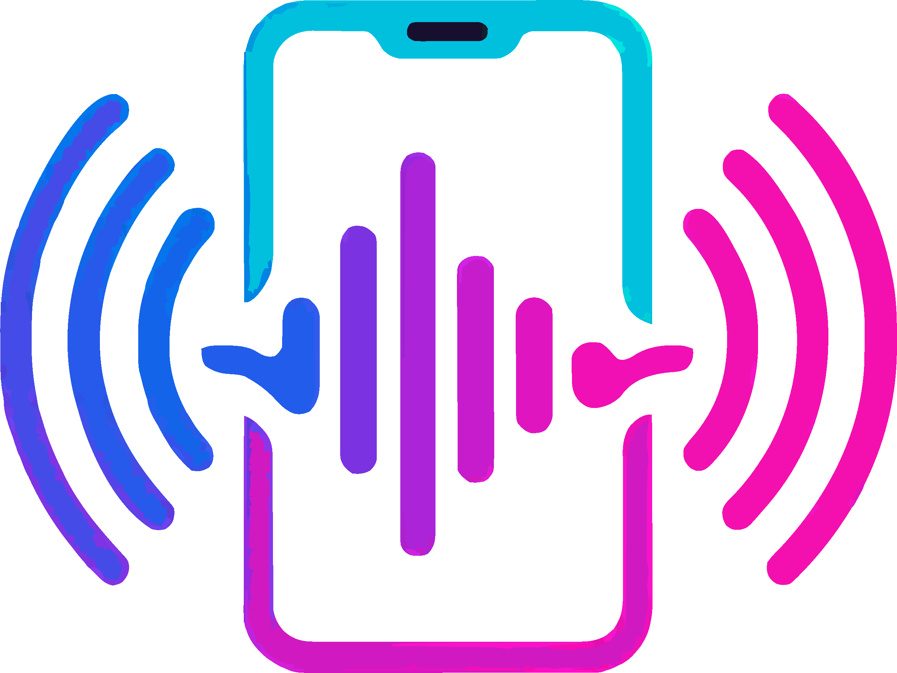

# 📡 EchoLink – Turn Your Phone Into a Wireless Speaker

<p align="center">
  
</p>

**EchoLink** is an Android app (built with **Jetpack Compose + MVVM**) that lets one device **Host** and other devices **Join** to share and play live audio over Wi-Fi (or hotspot).

Think of it like turning any Android phone into a **wireless Bluetooth-like speaker**, but with multiple receivers supported at once.

---

---

## 📥 Download

Get the latest signed APK of **EchoLink**:

[](https://github.com/anandkulkarni428/EchoLink/releases/download/v1.0.0/echolink-v1.0.0.apk)

👉 Clicking the button will start the APK download automatically.


## ✨ Features

- 🎵 **Live Audio Streaming**  
  Host captures playback audio (YouTube Music, Spotify, local files) via **MediaProjection + AudioPlaybackCapture**.

- 📲 **Multiple Receivers**  
  Any number of nearby devices can Join a host and play in sync.

- 📡 **Wi-Fi / Hotspot Based**  
  Works without internet, using **UDP multicast + service discovery**.

- 🔔 **Connection Management**  
  Hosts see a Listeners panel with latency (RTT) and per-device toggle.  
  Notifications on new connections. Goodbye messages on disconnect.

- 🎨 **Modern UI**  
  Jetpack Compose + Material 3  
  Role picker (Host / Join)  
  Reactive visualizer  
  Gradient cards, dark mode support

- 🔒 **Permissions Handled**  
  - Record Audio (for playback capture)  
  - Media Projection (to capture system/app audio)  
  - Notifications (Android 13+)  

---

## 🛠 Technical Details

**Architecture**: MVVM (ViewModel, StateFlow, UseCases)  
**UI**: Jetpack Compose, Material 3, custom animations  
**Networking**:
- UDP sockets for low-latency streaming
- NSD (Network Service Discovery) for host discovery
- Simple protocol (HELLO / GOODBYE / PING / PONG)

**Audio Pipeline**:
- Host: `AudioRecord` (AudioPlaybackCaptureConfig) → MediaCodec AAC encoder → UDP packets  
- Receiver: UDP packets → jitter buffer → MediaCodec AAC decoder → AudioTrack  

---

## 📱 Screens

- **Role Picker** → choose Host or Join  
- **Host Screen** → Start/Stop hosting, Listeners panel, notifications  
- **Receiver Screen** → Join host and play audio, animated visualizer  

---

## 🚀 Roadmap / Ideas

- Volume sync across devices  
- Fine-tuned jitter buffer for lower latency  
- LAN discovery without NSD (fallback)  
- Background play + Quick Tile toggle  

---

## ⚠️ Notes

- Requires **Android 10+** (AudioPlaybackCapture API).  
- DRM-protected apps (Netflix, Prime Video, etc.) may block capture.  
- Works best on strong Wi-Fi / hotspot connections.  

---

## 📜 Attributions & Copyrights

- **Logo & Branding**: created by the EchoLink team. AI tools (ChatGPT) were used for ideation, but final assets are original.  
- **Icons**: Material Symbols / Material Icons (Apache License 2.0)  
- **Libraries**:  
  - [Jetpack Compose (AndroidX)](https://developer.android.com/jetpack/compose) — Apache License 2.0  
  - [Material 3](https://m3.material.io/) — Apache License 2.0  
  - [Media3](https://developer.android.com/guide/topics/media/media3) — Apache License 2.0  

- **AI Disclosure**: Some documentation and non-code content drafted with ChatGPT and reviewed by humans.  

---

## 📂 Project Setup

Clone the repo and open in Android Studio (Giraffe+).  
Make sure you are running on **Android 10+** devices.

```bash
git clone https://github.com/anandkulkarni428/EchoLink.git
cd echolink
```

---

## 📧 Contact & 🐛 Issues

👤 **Anand Kulkarni** — [LinkedIn](https://www.linkedin.com/in/anand-kulkarni-418249188/)  

Found a bug or have a feature request? 👉 [Open an Issue](https://github.com/anandkulkarni428/EchoLink/issues)  

⭐ Like the project? Don’t forget to **Star** the repo!

---

## 📖 License

Licensed under the **Apache License 2.0** — see [LICENSE](LICENSE).


